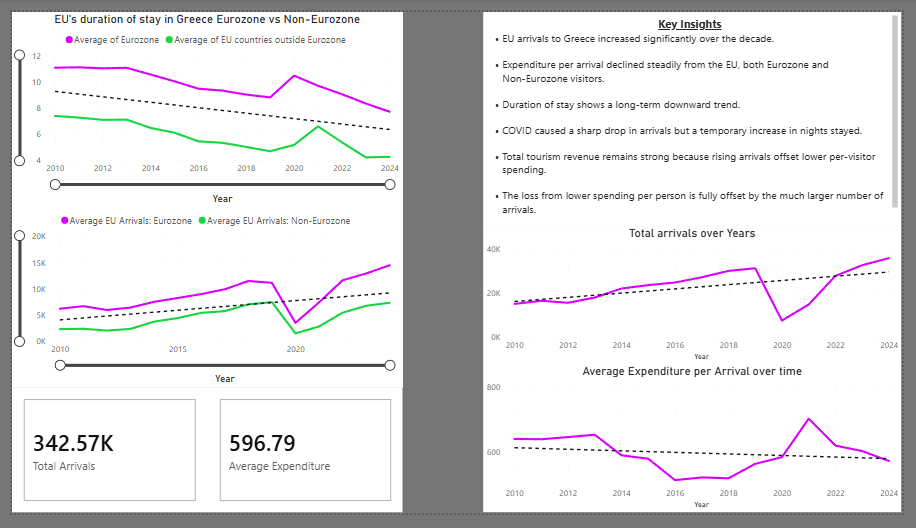

# Greece Tourism Analysis (2010–2024)

A Power BI project analysing tourism trends in Greece using official EU arrival data.  
This report compares Eurozone vs Non‑Eurozone visitors across key metrics: arrivals, expenditure, and duration of stay.


## Project Overview

This dashboard explores how EU tourism to Greece has evolved over the past decade, highlighting long‑term trends, behavioural shifts, and the impact of COVID‑19.  
The analysis uses publicly available data from the Hellenic Statistical Authority (ELSTAT).

The project includes:

- Power BI dashboard (`Greece-Tourism-Analysis.pbix`)
- Dataset (`Key_figures_of_incoming_Tourism.xlsx`)
- Dashboard preview (`Dashboard.png`)


## Key Insights

- **[EU arrivals](ca://s?q=Explain_EU_arrivals_trend)** to Greece increased significantly over the decade.
- **[Expenditure per arrival](ca://s?q=Explain_expenditure_per_arrival_trend)** declined steadily for both Eurozone and Non‑Eurozone visitors.
- **[Duration of stay](ca://s?q=Explain_duration_of_stay_trend)** shows a long‑term downward trend.
- **[COVID‑19 impact](ca://s?q=Explain_COVID_impact_on_Greek_tourism)** caused a sharp drop in arrivals but a temporary increase in nights stayed.
- **[Total tourism revenue](ca://s?q=Explain_total_tourism_revenue_trend)** remains strong because rising arrivals offset lower per‑visitor spending.
- The loss from lower spending per person is fully offset by the much larger number of arrivals, meaning Greece’s tourism sector has performed strongly overall across the past decade.


## Files Included

- `Dashboard.png` — exported visual of the Power BI report  
- `Greece-Tourism-Analysis.pbix` — full Power BI project file  
- `Key_figures_of_incoming_Tourism.xlsx` — dataset used for the analysis  
- `README.md` — project documentation


```md

